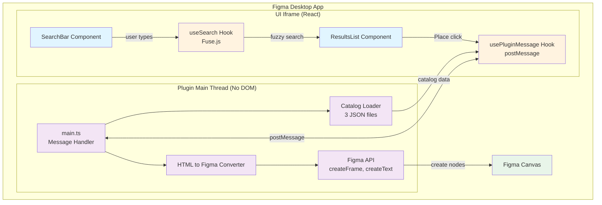
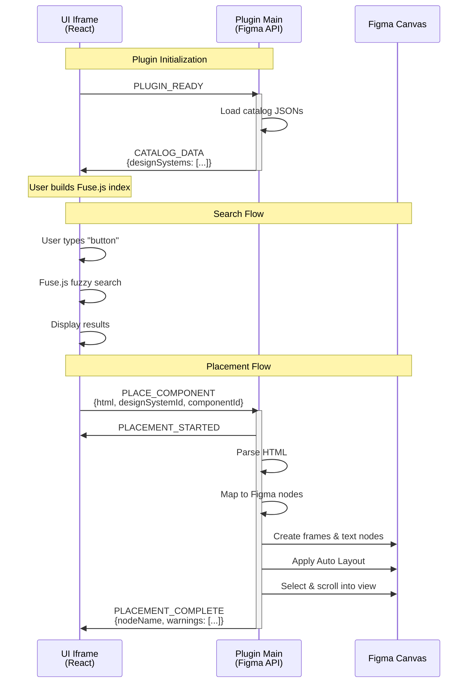
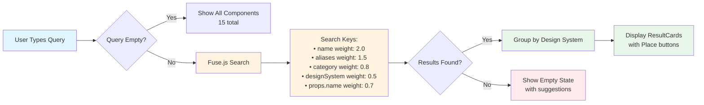
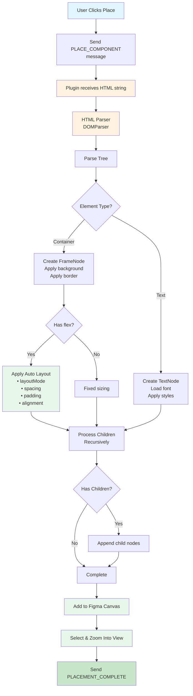
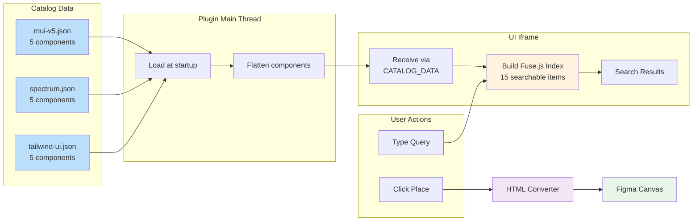
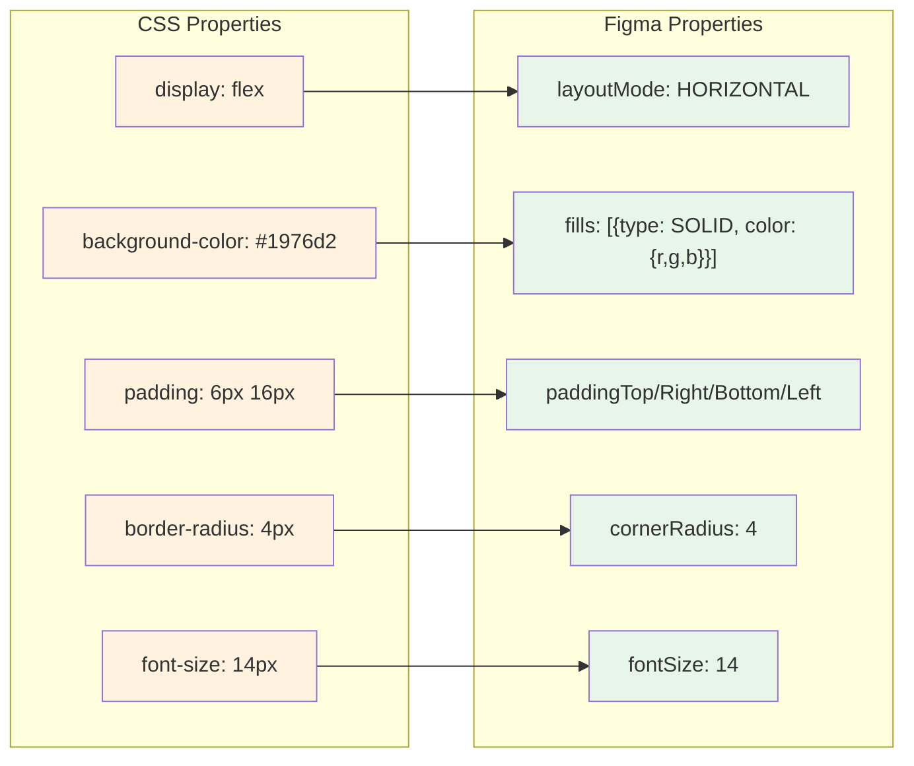
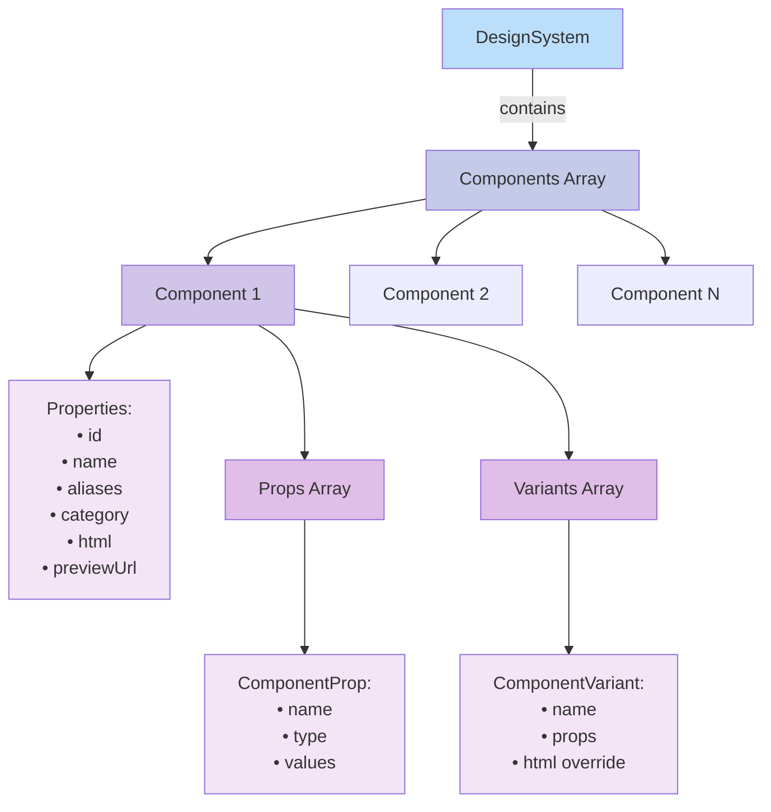
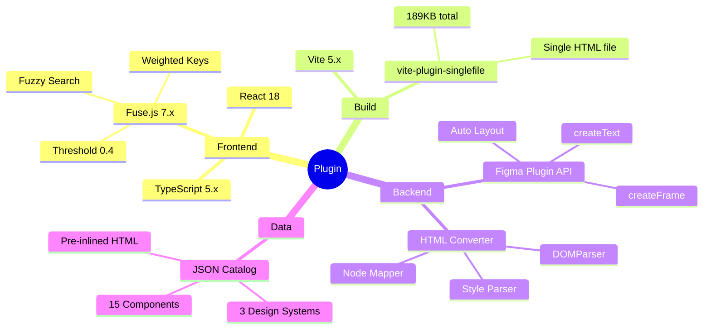

# Plugin Architecture Diagrams

## System Architecture

## Message Protocol Flow

## Search Workflow

## Component Placement Workflow

## Data Flow

## CSS to Figma Mapping

## Component Structure

## Key Technologies

